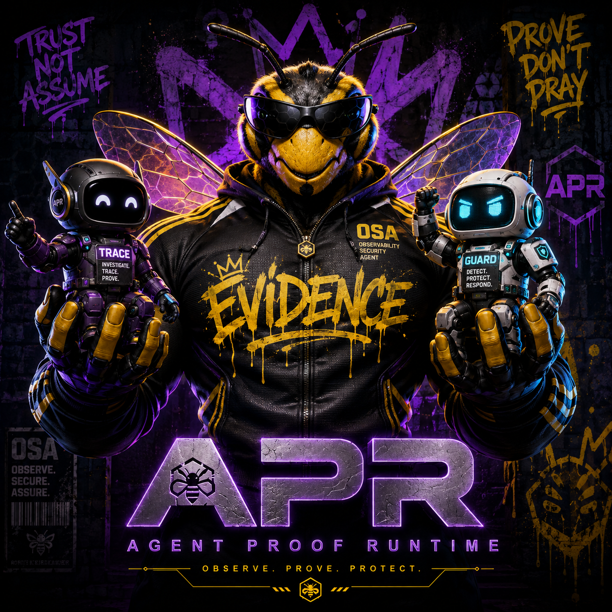

<p align="center">
  
</p>

<p align="center"><strong>Observe. Prove. Protect.</strong></p>

# Agent Proof Runtime

## In 5 seconds

**What it is**  
APR is a proof runtime for autonomous AI work. It turns agent output into a verifiable evidence trail instead of a trust-me demo.

**Why it exists**  
Useful artifacts and pretty logs are not enough when you need to prove what ran, what passed, and what changed.

**Where it comes from**  
APR was built as the Agent Proof Runtime project around strict mission manifests, deterministic checks, Proof Bundles, Mission Control, Tamper Lab, and a live-validated GPT-5.6 path.

## Core idea

```text
Mission Manifest
  -> provider output
  -> runtime enforcement
  -> deterministic checks
  -> event chain + Merkle root
  -> Proof Bundle
  -> independent verification
```

APR does **not** claim hardware-backed trust. Its honest labels are:

- `LOCAL_VERIFIED`
- `FAILED`
- `UNANCHORED`
- `development-only`

## Quick start

```bash
apr mission validate examples/build-week-mission.json
apr run examples/build-week-mission.json \
  --provider fixture \
  --output .runs/build-week-demo
apr verify .runs/build-week-demo/proof-bundle.json
```

Expected result:

```text
Mission: PASSED
Proof:   LOCAL_VERIFIED
Anchor:  UNANCHORED
```

## Main components

- **Mission Control** — visual control panel and demo surface
- **Proof Bundle** — versioned evidence package
- **Independent verifier** — re-checks hashes, events, Merkle root, and bundle integrity
- **Tamper Lab** — mutates a copy and proves detection works
- **Mission Studio** — seven-agent pipeline behind one proof boundary

## Live demo

- Mission Control: <https://agent-proof-runtime-production.up.railway.app>
- Health: <https://agent-proof-runtime-production.up.railway.app/health>
- 90-second demo: <https://youtu.be/6UFQjGiVqbs>

## Main docs

- [Project Manifesto](docs/PROJECT_MANIFESTO.md)
- [Product Blueprint](docs/PRODUCT_BLUEPRINT.md)
- [Mission Studio](docs/MISSION_STUDIO.md)
- [Mission Studio live OpenAI mode](docs/MISSION_STUDIO_OPENAI.md)
- [Controlled live validation](docs/LIVE_VALIDATION.md)
- [Hosted deployment validation](docs/HOSTED_VALIDATION.md)
- [Build Week guide](docs/BUILD_WEEK.md)
- [Build Week changelog](docs/BUILD_WEEK_CHANGELOG.md)
- [Gap audit](docs/BUILD_WEEK_GAP_AUDIT.md)
- [Codex collaboration](docs/CODEX_COLLABORATION.md)

## Book

<a href="book/PROOF_BEFORE_TRUST.md">
  
</a>

- [Book overview and table of contents](book/README.md)
- [Read the complete assembled manuscript](book/PROOF_BEFORE_TRUST.md)
- [Review the repository evidence map](book/SOURCES.md)

## License

Released under the [MIT License](LICENSE).
